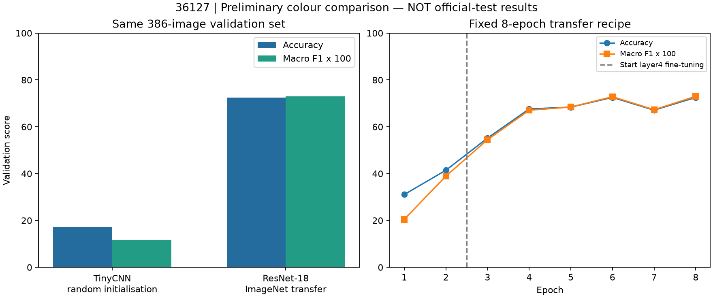

# Colour transfer-learning pilot — 36127

Yuchen MENG, 11 September 2026. Review contribution, not a production release.

## Verified result

On the same capped CompCars surveillance validation set (386 images), the
ResNet-18 ImageNet transfer pilot achieved **72.54% accuracy (280/386)** and
**0.7299 macro F1**, compared with TinyCNN's **17.10% / 0.1177**. Fit images: 1,540;
classes: ten. Best epoch 8, chosen by validation macro F1. Official-test model
evaluation was **not** performed. Changing architecture, resolution, pretraining
and schedule together is not an isolated pretraining ablation.



## What this contribution adds

- Installable package metadata, explicit-root data loading, shared class mappings,
  supervised modelling and the shared analyse_vehicle_image entry point.
- Archive CRC checking, official-label/image audit, controlled three-task pilot
  scripts and the fixed-split colour transfer script.
- Tests and selected public-safe evidence. The previous HSV baseline function is
  preserved. No Streamlit UI, original team CSV or detector implementation changed.
- Missing official body type 0 is excluded from body training only, not relabelled
  convertible. Exact-byte duplicates crossing train/test are excluded from train.

The existing generic configs/train_*.yaml describe separate random-initialisation
experiments; they are NOT the recipe behind the reported transfer result. Use
scripts/train_colour_transfer.py and the recorded evidence config for this result.

## Run tests

Create an isolated environment, explicitly install PyTorch/TorchVision for your
hardware using [official instructions](https://pytorch.org/get-started/locally/),
then install the remaining dependencies in pyproject.toml. The original team's
requirements.txt is preserved, not presented as the tested local environment.

```text
python -m pip install -e . --no-deps
python -m unittest discover -s tests -v
```

These commands assume dependencies are already installed. Twenty-one tests passed
on the staged latest-main + contribution tree in the existing environment. This
is a local test result, not a GitHub CI pass or clean-install validation.

## Reproduce from authorised local data

Keep CompCars photos and archives outside the repository. Set a shell variable
`$archivesRoot` to your archive parent. The expected extracted layout is
`data/data/image`, `data/data/misc` and `sv_data/sv_data/image` beneath that parent.
Original team manifest paths are mapped in memory; original CSVs are not rewritten.
Use new output directories for each run.

```powershell
python scripts/compcars_archive_integrity.py --archives-root "$archivesRoot" --output outputs/integrity_01
python scripts/audit_local_compcars.py --archives-root "$archivesRoot" --integrity outputs/integrity_01 --output outputs/audit_01
```

The audit intentionally exits 2 when the known 721 missing-body-label mismatches
are present. Read its audit_summary.json. Do not ignore unrelated failures. The
pilot script independently allows only the known body-label category, excludes
official type 0 and checks every remaining body label; other errors must pass.

```powershell
python scripts/train_real_compcars_pilots.py --archives-root "$archivesRoot" --audit outputs/audit_01 --output outputs/pilots_01 --device cuda
python scripts/train_colour_transfer.py --archives-root "$archivesRoot" --previous-pilot outputs/pilots_01/colour --audit outputs/audit_01 --weights "$weightsPath" --provenance docs/evidence/colour_transfer_2026-09-11/pretrained_provenance.json --output outputs/colour_transfer_01 --device cuda
```

Set `$weightsPath` to an authorised local copy of the exact pretrained checkpoint
documented in pretrained_provenance.json. These training commands do not download
weights. The official source is
https://download.pytorch.org/models/resnet18-f37072fd.pth (46,830,571 bytes).
Review model/training-data conditions before acquisition or use. CPU is an explicit
alternative device; performance and timing may differ. Repository files alone do
not include the data or trained weights needed to reproduce predictions.

## Recipe and integration

Eight fixed epochs: two head-only, then six layer4 + head; all BatchNorm running
statistics frozen. AdamW LRs head 0.001 / layer4 0.0001, weight decay 0.01, batch
32, seed 36127, deterministic operations, zero loader workers. Whole-crop OpenCV
resize to 224x224, RGB, ImageNet mean/std, no colour-changing augmentation. This
is explicitly different from the official resize/centre-crop weight transform.

Load the trusted local best.pt using AttributePredictor, then pass
`{'colour': predictor}` to analyse_vehicle_image. Output remains pilot_prediction
with uncalibrated scores. Supply an existing detector checkpoint or explicit boxes;
the pipeline never auto-downloads weights. Generic evaluate CLI is not the audited
external-root/frozen-split protocol used here; do not use it to claim this result.

## Evidence and limits

[Evidence folder](evidence/colour_transfer_2026-09-11/) contains the actual metrics,
epoch history, confusion matrix, per-class recall, aggregate class counts, measured
latency, recipe and package versions. Runtime command paths were omitted; the
training log is explicitly labelled an excerpt. The complete private evidence is
retained locally. No photo, model weight, per-image manifest or personal path is
included in this contribution. Source CSVs already on main remain unchanged.

CPU checkpoint reload matched GPU validation; CSV metrics were reconstructed
independently. A single supplied whole-image box verified the predictor/pipeline
interface; **no live YOLO run** is claimed. GPU forward-only median latency was
1.81 ms (batch one, 224px, ten warmups, fifty trials), excluding loading, crop
preprocessing, detector and UI. Do not call it end-to-end application latency.

Weak validation classes: yellow recall 47.5% (19/40), champagne 52.5% (21/40).
Lighting causation is not established. This is capped validation used for epoch
selection, not full-data, independent-test, near-duplicate/vehicle-disjoint,
police-domain, calibrated or deployment-ready performance. Make/body models were
not upgraded by the colour experiment. Next: near-duplicate audit and a larger
training-only validation recipe before any frozen official-test evaluation.

## References

TorchVision maintainers and contributors. (2024). *resnet18 — TorchVision 0.20
documentation*. https://docs.pytorch.org/vision/0.20/models/generated/torchvision.models.resnet18.html

TorchVision maintainers and contributors. (2024). *Pre-trained model license notice*.
https://github.com/pytorch/vision/tree/v0.20.1#pre-trained-model-license

Model/training-data rights require separate consideration from code licensing.
This work is local course research; commercial/redistribution clearance is not
asserted. No client imagery was accessed.
