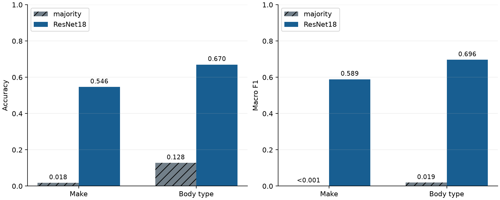
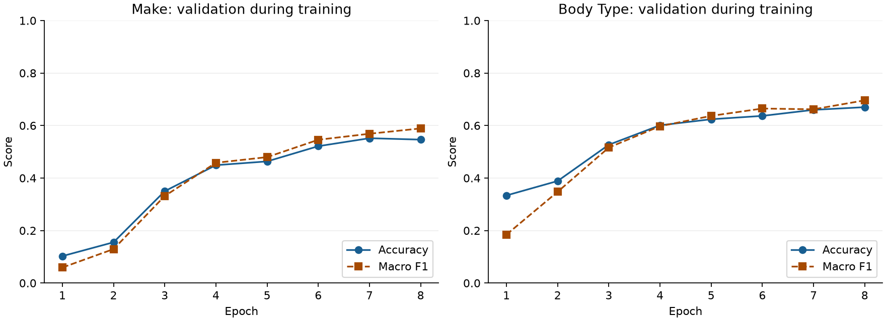
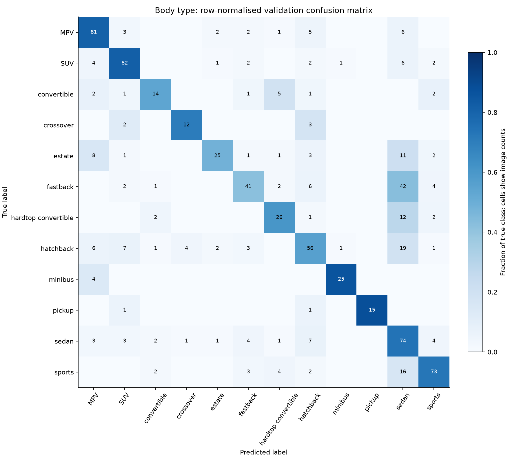

# Vehicle metadata v0.1 — make and body type

Local CompCars validation pilots built on Yuchen's shared model framework and Nicholas's manifests.

## Validation results

| Task | Images | Classes | ResNet18 accuracy | Macro F1 | Majority accuracy |
|---|---:|---:|---:|---:|---:|
| make | 1120 | 75 | 54.64% | 0.5890 | 1.79% |
| body_type | 782 | 12 | 67.01% | 0.6961 | 12.79% |

Both checkpoints passed a fresh-process CPU reload and independent metric reconstruction from saved predictions. These are capped, image-level validation results from one fixed seed, not official-test results or estimates for operational police imagery.

## Recipe and coverage

ResNet18 ImageNet initialization; RGB 224×224 square crops and ImageNet normalization; batch 32; two head-only epochs then six layer4/head epochs; frozen BatchNorm statistics; seed 36127. Validation macro F1 selects the checkpoint, with earliest-epoch tie breaking. No augmentation. Official 1-based boxes are converted once for loading. The make cap is 100 and body-type cap is 500 images per class before the 80/20 split.

## Error analysis

Full class support/recall and every nonzero off-diagonal confusion are retained in the companion CSV files. The following are the largest observed confusion counts, selected by count rather than example appearance:

| Task | True label | Predicted label | Images |
|---|---|---|---:|
| make | Volvo | BWM | 6 |
| make | Buck | Skoda | 4 |
| make | Citroen | Skoda | 4 |
| make | GreatWall | Haima | 4 |
| make | Haima | MAZDA | 4 |
| body_type | fastback | sedan | 42 |
| body_type | hatchback | sedan | 19 |
| body_type | sports | sedan | 16 |
| body_type | hardtop convertible | sedan | 12 |
| body_type | estate | sedan | 11 |

## Source manifest coverage

The frozen source manifest contains 30,925 classification rows. A subsequent audit found 30,955 paths in the official classification lists: 13 train and 17 test images with unknown-year paths are missing from the source CSV. The notebook path pattern accepts only numeric years. The images exist locally. These measurements retain the original v0.1 manifest and are not a complete official classification benchmark. A versioned coverage correction is required before the larger-data experiment; see [source coverage](../source_coverage.json).

## Limits and contribution

- Exact-byte duplicates crossing official train/test are excluded from training. One representative per remaining hash is used. Near-duplicate and physical-vehicle independence are not established.
- Official type 0 is unavailable. It is excluded only from the body task; valid make targets are retained.
- Scores are uncalibrated softmax scores. Weak, small or occluded crops can produce incorrect high scores. No abstention threshold has been validated.
- Class-name spelling follows the source manifest, including names such as Chrey and Wealeak. These labels have not been standardised for a user-facing taxonomy.
- Vehicle-model recognition, damage and accessories remain not assessed. Colour requires Yuchen's trained local checkpoint; synthetic software checks do not reproduce his colour experiment.
- Yuchen supplied the shared dataset/predictor/pipeline, pilot split and colour transfer recipe. This work adds the make/body transfer runner, verified outputs, bbox/interface checks and local demo/export workflow.
- CompCars web data came from a separately recorded mirror. All extracted files were CRC-checked against that archive; 100 images matched decoded official bytes. That sample is not full publisher authentication.

AI assistance was used for implementation, verification scripts and drafting. These artifacts remain subject to Yuxiang's review before any coursework submission.
